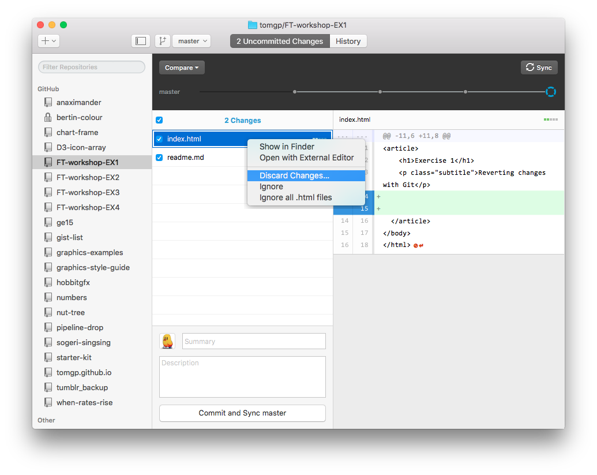
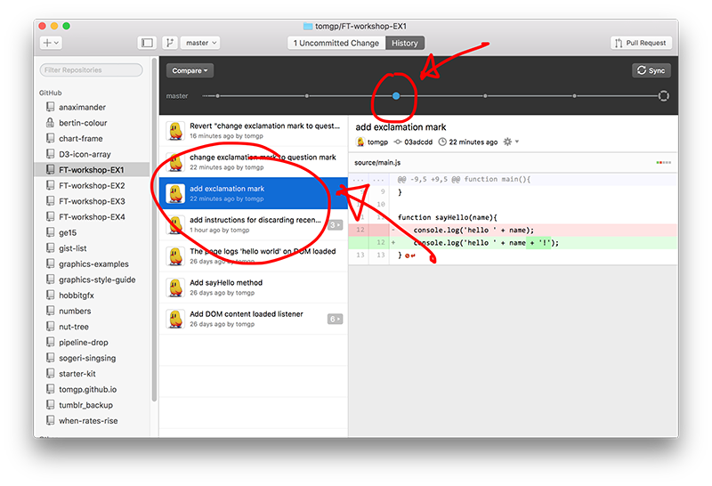
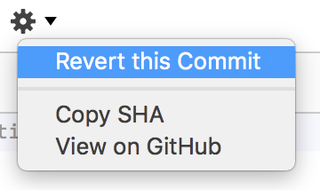

First exercise for a D3 workshop running at the Financial Times

 * __Prerequisit:__ An idea of what Git is.
 * __Prerequisit:__ The GitHub desktop client ( [download the GitHub desktop client](https://desktop.github.com/) )
---
#Reverting changes with Git

One of the immediate benefits of using source control is that it can increase your confidence in (and so your likelihood of) making changes and improvements to existing code. This can help you write better more flexible code and help fight bad habits like commenting out large chunks of code and keeping code that is no longer used in your files which may confuse you later.

###Create a local repository

Before we start you'll need a local repository to work through the steps on your computer. If you have the GitHub desktop client installed on your computer it should be simply a question of either..

 * Visiting [the repository for this excercise](https://github.com/tomgp/FT-workshop-EX1) and clicking on the 'Clone in Desktop' button
 * Clicking [this link here](github-mac://openRepo/https://github.com/tomgp/FT-workshop-EX1), [or this one](github-mac://openRepo/https://github.com/tomgp/FT-workshop-EX1)

---

###Discarding recent changes

This is the most common case: You've made some changes and broken something, you haven't commited the changes to your repository and just want to get back to when things were working 5 minutes ago.

Here's how you do it.

First go into your text editor and make some changes, some *BAD* changes. Go into `index.html` in the repo you just made, change a bunch of stuff and save the file. Oh no, let's fix this terrible mess!

The main panel on the GitHub desktop client can show one of two things 'Uncomitted Changes' or 'History'. Make sure you're looking at uncomitted changes. That fine mess you just made should be shown on the right and the name of the file in which you made it on the left right-click (or cmd-click if you prefer) on the file name and select 'Discard Changes...'

You'll then be asked to confirm you want to discard your chages:

> Are you sure you want to discard all changes to "index.html"?

Yes, you are!

Now if you go back into your editor you'll see the file is in it's nice un-ruined original condition.

---

###Rolling back to a certain point in history

Make some mistakes and commit them to your repository.

Uh oh! You've made more of a mess of things and commited your changes to the repository! Don't worry, all is not lost you can go back to any point in your commit history and make things right again.

If you make small commits, relating to a single feature or file then this can be relatively painless  otherwise it can be a bit tricky. 

There are a couple of places within the GitHub app where you can review your commit history:

To revert a commit, select that commit either from the list on the left, or the timeline above.

When you've selected your commit you can see the details of what that commit changed in the main panel. Click on the little cog icon to reveal a menu and select 'Revert This Commit'

Phew!

If you want to go back several commits, your best bet it to revert them in order from newest to oldest. If you revert commits in any other order, you may see merge conflicts -- you don't want that.

---

###Branching and merging

Although we'll be using the GitHub client you can do similar thinsg with the command line or other UIs like SourceTree